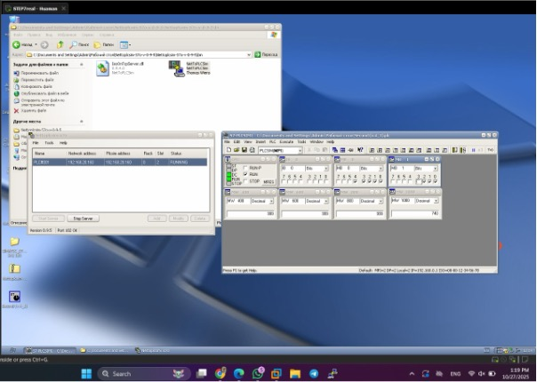

# SCADA Attacks Lab

## Overview
This repository contains the implementation of a SCADA (Supervisory Control and Data Acquisition) security lab focusing on reconnaissance, MITM attacks, packet manipulation, and DoS techniques against a simulated industrial automation environment.

The lab includes:
- Siemens STEP7 PLC simulation  
- Wonderware InTouch HMI  
- NetToPLCSim PLC communication bridge  
- Kali Linux attacker VM with Ettercap + Wireshark  

The environment replicates a small industrial control network, allowing practical exploration of ICS‑specific threats.

---

## Experimental Setup

### Network Topology
- **Target1 – SCADA/HMI (Windows XP)**  
- **Target2 – PLC Simulation (Windows XP)**  
- **Attacker – Kali Linux 2024.x**

Subnet: **192.168.20.0/24**

---

## Experimental Procedure

### Step 1 – Start STEP7 project
Launch the PLC logic using the file `Second(v.4_1)`.

---

### Step 2 – Configure NetToPLCSim
Bridge PLC simulation to SCADA using IP **192.168.20.160**.

🖼️ `nettoplcsim.jpg`

---

### Step 3 – Verify connectivity  
Ping the PLC simulation server from SCADA VM.

🖼️ `check_ping.jpg`

---

### Step 4 – Check ARP table  
Confirm active hosts.

🖼️ `arp_table.jpg`

---

### Step 5 – Configure SCADA VM network  
Assign static IP address.

🖼️ `ip_address_config.jpg`

---

### Step 6 – Validate communication  
Ping between SCADA and PLC.

🖼️ (same as Step 3)

---

### Step 7 – Status of PLC variables  
🖼️ `params_status.jpg`

---

### Step 8 – Launch Wonderware InTouch  
🖼️ `load_intouch.jpg`

---

### Step 9 – PLC/HMI runtime window  
🖼️ `378FD61D-A390-41F0-ACE2-D7D36A2BB074.png`

---

# MITM Attacks (ARP Spoofing, DNS Spoofing, Packet Injection)

### Рисунок 11 – ARP table on SCADA during attack
🖼️ `970A16F2-DD7C-4145-9BF6-3890BCE188F2.png`

---

### Рисунок 12 – Configure IP on Kali  
🖼️ `A5C0E087-B954-4D8B-A60B-53084DBA50CE.png`

---

### Рисунок 13 – Connectivity test to both targets  
🖼️ `DAD6FB4C-18CC-4295-AAC4-7E403D38803C.png`

---

### Рисунок 14 – Start Ettercap and select interface  
🖼️ `9503C8D8-3D60-44E3-A6C2-04F632896F1C.png`

---

### Рисунок 15 – Host scan  
🖼️ `5685F8CF-25E8-48BD-8CED-6A5BEE1D74A7.png`

---

### Рисунок 16 – Host list  
🖼️ `CC05A677-0E00-48E8-B0E5-7D34CE109A66.png`

---

### Рисунок 17 – Add hosts to Target1/Target2  
🖼️ `397CDDB0-EF8F-4F1D-A2E1-9D3A612835FD.png`  
🖼️ `95474474-49AE-4A11-8FF7-4CD69C921F00.png`

---

### Рисунок 18 – Protocol setup for packet filtering  
🖼️ `211CF07C-931D-449D-9881-84FE64B25355.png`

---

### Рисунок 19 – ARP poisoning attack  
🖼️ `B025A9B9-97E2-444D-BF3B-1ED271494CC3.png`

---

# Packet Capture & Manipulation (Wireshark + Ettercap)

### Рисунок 21 – Capturing packets after MITM begins
🖼️ `packets_arp_poisoning.jpg`

---

### Рисунок 22 – Enabling Ettercap plugin `dns_spoof`
🖼️ `pluggin_dns_spoof.jpg`

---

### Рисунок 23 – Loading custom attack script  
🖼️ `file_script.jpg`

---

### Рисунок 24 – Finding a packet with value `00 55`
🖼️ `packet_cero_five.jpg`

---

### Рисунок 25 – Filter applied successfully  
🖼️ `applied_filter.jpg`

---

# DoS Attack & Final Result

### Рисунок 26 – Executing DoS attack  
🖼️ `dos_attack_sent.jpg`

---

### Рисунок 27 – Packets captured during DoS  
🖼️ `wireshark_dos_attack.jpg`

---

### Рисунок 28 – DoS attack successful  
🖼️ `vm_dos_attack_successful.jpg`

---

# Author
**Bruno P. Huaman Vela**  
Information Security in Telecommunication Systems  
Ural Federal University – 2025

