# SCADA Attacks Lab

## Overview
This repository contains the implementation of a SCADA (Supervisory Control and Data Acquisition) security lab focusing on reconnaissance, MITM attacks, packet manipulation, and DoS techniques against a simulated industrial automation environment.

The lab includes:
- Siemens STEP7 PLC simulation  
- Wonderware InTouch HMI  
- NetToPLCSim PLC communication bridge  
- Kali Linux attacker VM with Ettercap + Wireshark  

The environment replicates a small industrial control network, allowing practical exploration of ICS‑specific threats.

---

## Experimental Setup

### Network Topology
- **Target1 – SCADA/HMI (Windows XP)**  
- **Target2 – PLC Simulation (Windows XP)**  
- **Attacker – Kali Linux 2024.x**

Subnet: **192.168.20.0/24**

---

## Experimental Procedure

### Step 1 – Start STEP7 project
Launch the PLC logic using the file `Second(v.4_1)`.

---

### Step 2 – Configure NetToPLCSim
Bridge PLC simulation to SCADA using IP **192.168.20.160**.

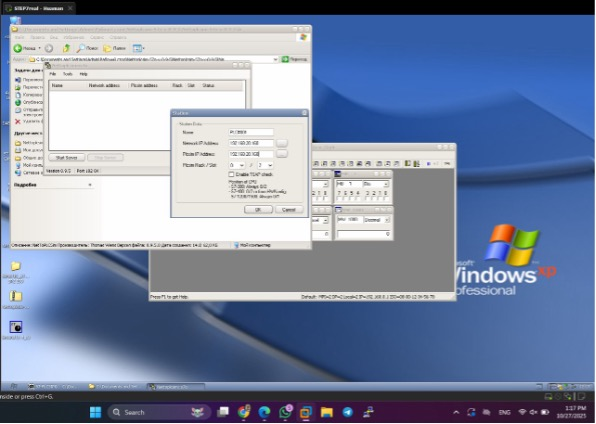

---

### Step 3 – Verify connectivity  
Ping the PLC simulation server from SCADA VM.

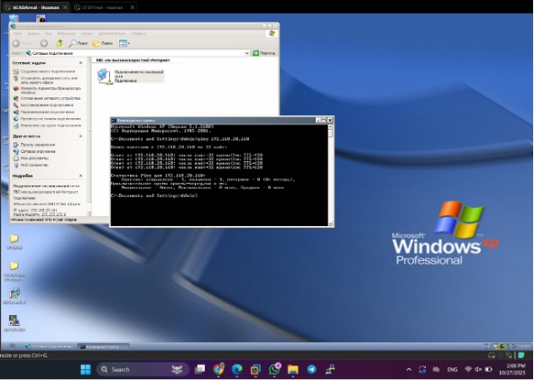

---

### Step 4 – Check ARP table  
Confirm active hosts.

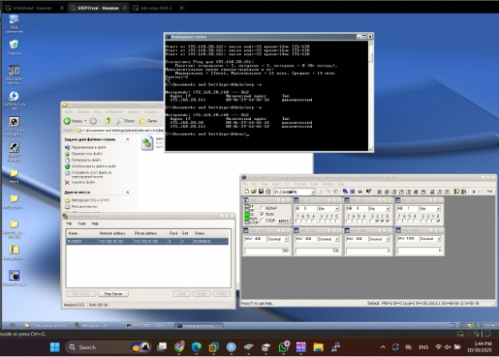

---

### Step 5 – Configure SCADA VM network  
Assign static IP address.

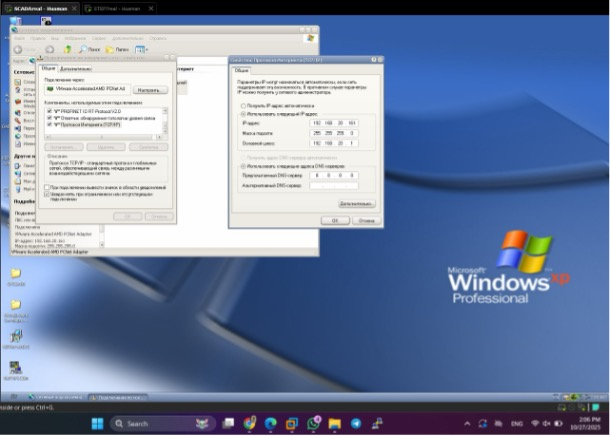

---

### Step 6 – Validate communication  
Ping between SCADA and PLC.

---

### Step 7 – Status of PLC variables  
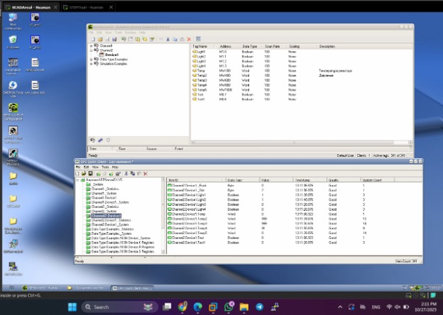

---

### Step 8 – Launch Wonderware InTouch  
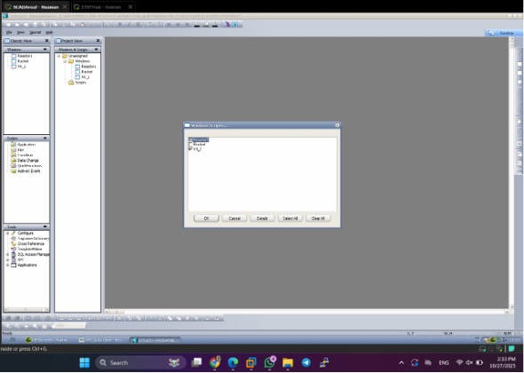

---

### Step 9 – PLC/HMI runtime window  
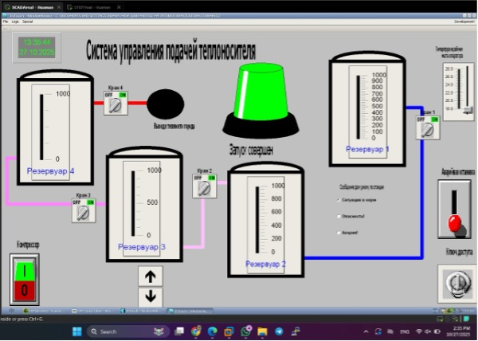

---

# MITM Attacks (ARP Spoofing, DNS Spoofing, Packet Injection)

### Рисунок 11 – ARP table on SCADA during attack
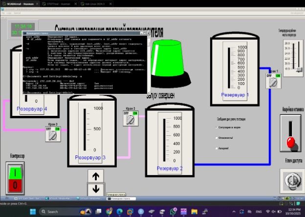

---

### Рисунок 12 – Configure IP on Kali  
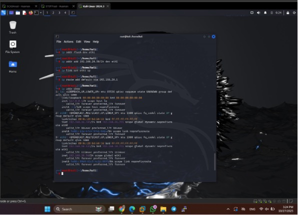

---

### Рисунок 13 – Connectivity test to both targets  
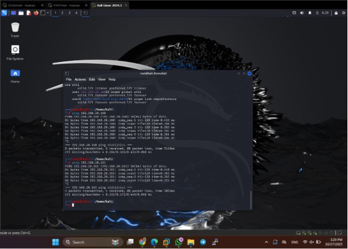

---

### Рисунок 14 – Start Ettercap and select interface  
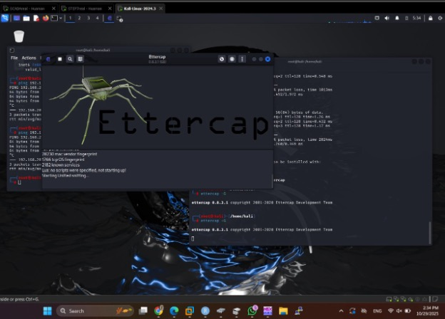

---

### Рисунок 15 – Host scan  
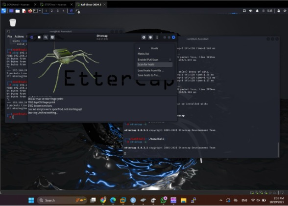

---

### Рисунок 16 – Host list  

---

### Рисунок 17 – Add hosts to Target1/Target2  
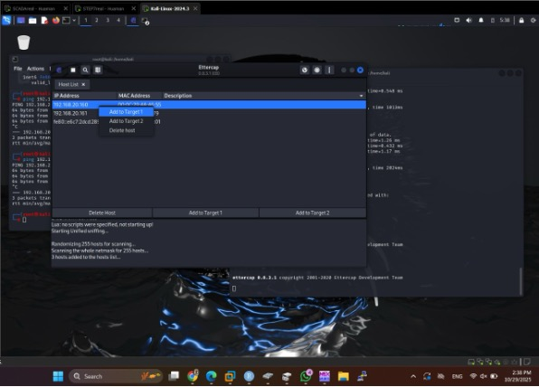

---

### Рисунок 18 – Protocol setup for packet filtering  
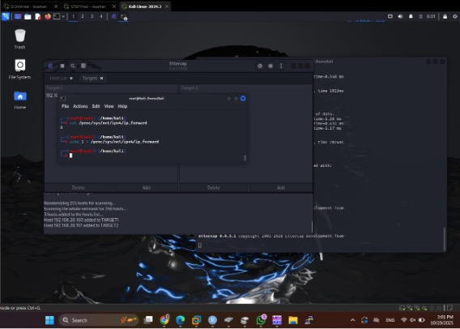

---

### Рисунок 19 – ARP poisoning attack  
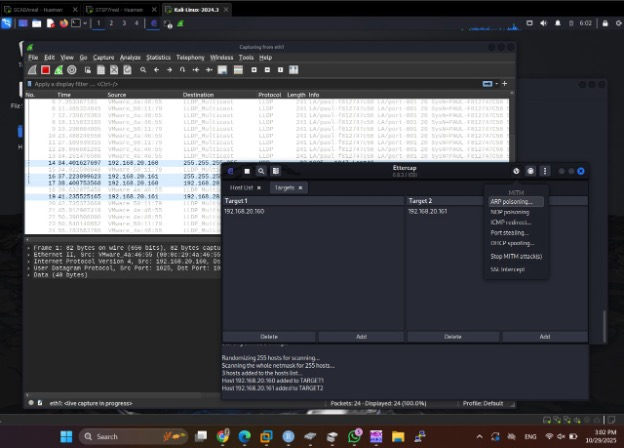

---

# Packet Capture & Manipulation (Wireshark + Ettercap)

### Рисунок 21 – Capturing packets after MITM begins
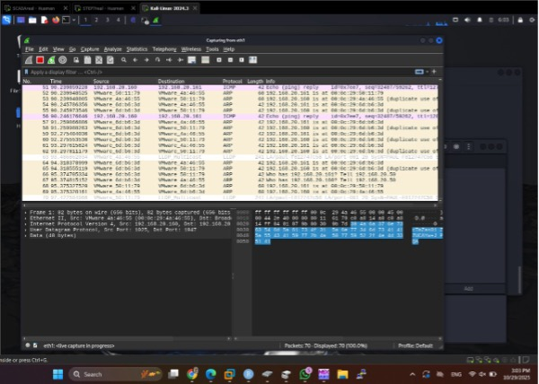

---

### Рисунок 22 – Enabling Ettercap plugin `dns_spoof`
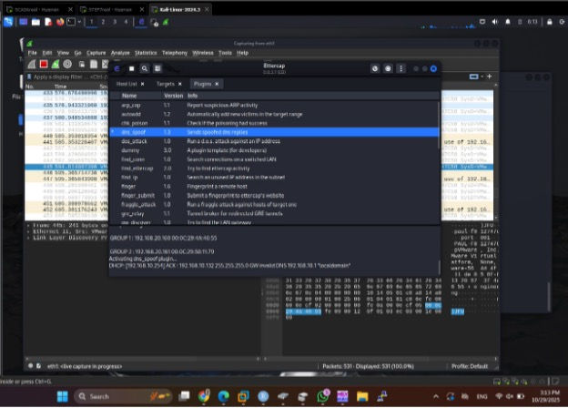

---

### Рисунок 23 – Loading custom attack script  
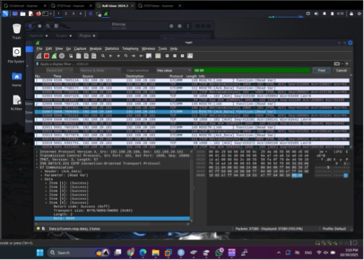

---

### Рисунок 24 – Finding a packet with value `00 55`
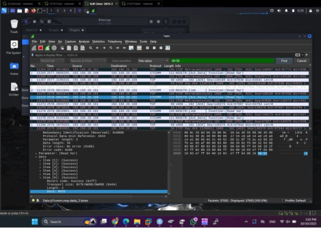

---

### Filter applied successfully  

---

# DoS Attack & Final Result

### Рисунок 26 – Executing DoS attack  
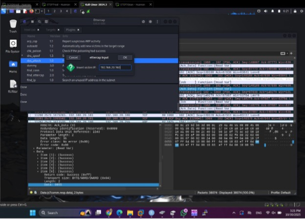

---

### Рисунок 27 – Packets captured during DoS  
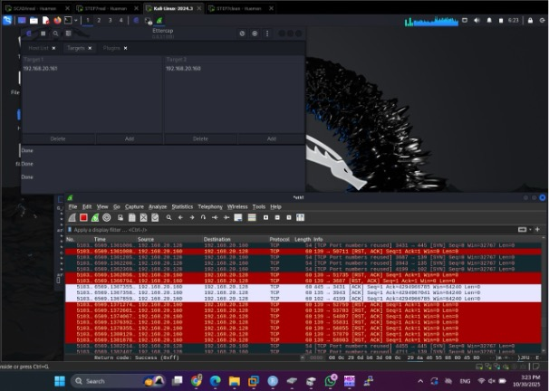

---

### Рисунок 28 – DoS attack successful  
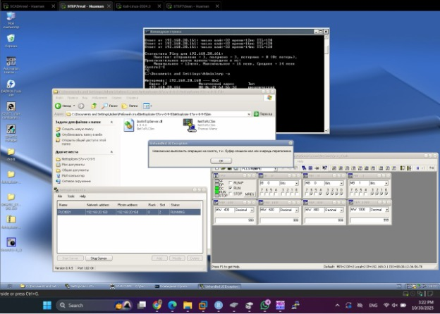

---

# Author
**Bruno P. Huaman Vela**  
Information Security in Telecommunication Systems  
Ural Federal University – 2025

